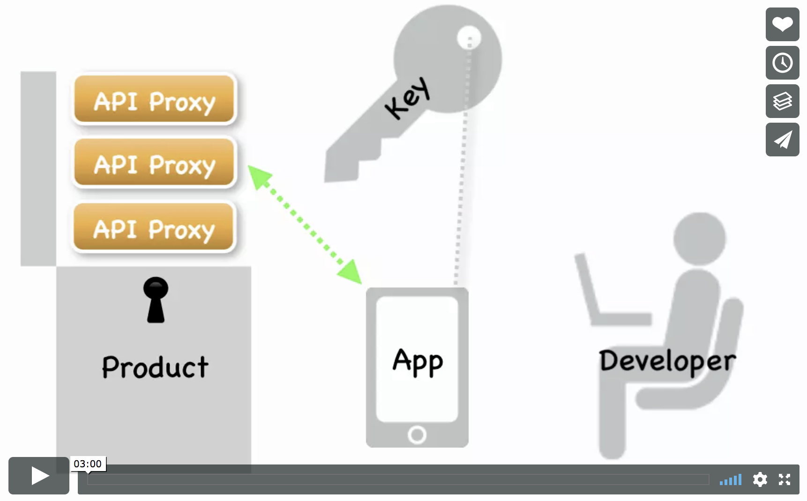
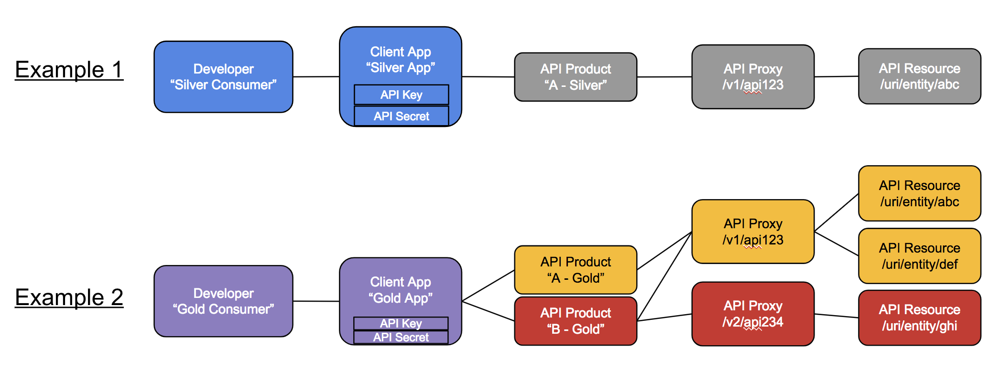
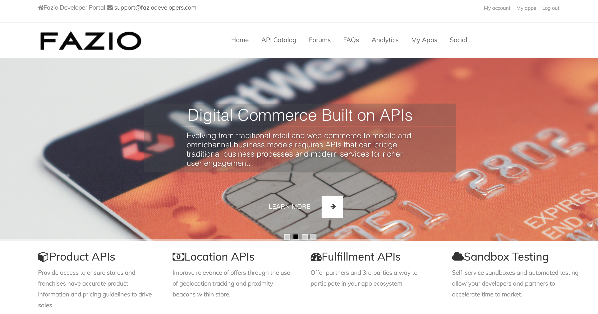
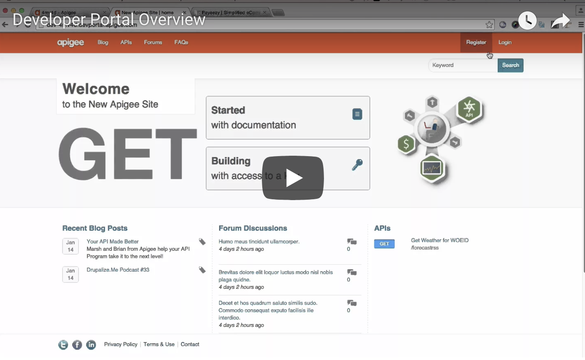
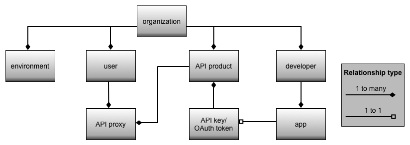

# Basic Concepts - Part 2

Here are some basic concepts to introduce you to API Publishing using the Apigee Edge API Management Platform.

**Contents**

* Publishing APIs using Apigee Edge
* What is an API Product?
* What is the Apigee Edge Developer Portal?
* Relationship between Developers -> Apps -> API Keys -> API Products -> API Proxies

# Publishing APIs using Apigee Edge

Publishing is the process of making your APIs available to app developers for consumption. Publishing APIs involves the following tasks, described in this topic:

1. Create the API products on Edge that bundle your APIs.
2. Register app developers on Edge.
3. Register developer apps on Edge.
4. Provide documentation and community support for your APIs.

Here's a brief video to explain publishing on Apigee Edge:

# What is an API Product?

An API product bundles API resources, such as API proxies and the API resource URIs that the proxy exposes, in order to provide a specific level of access and functionality for client app developers. An API product typically specifies a list of API proxies and API resource URIs, along with access limits, API key approval method, and other configuration that define how the bundled APIs can be used.
Typically, this type of bundling allows API producers to decouple the development and production of the API, from the consumption of the API. By doing so, API producers are able to provide different access models and tiers for their APIs. Different API products - perhaps even bundling the same API proxies - provide service levels for different use cases. Instead of just giving developers a list of resources, you can bundle specific resources together to create a product that solves a specific user need.

### API Keys

On Apigee Edge, API proxies bundled within API products, can be accessed using an API key. Each client application registered by app developers on Edge, is assigned an API key and API secret. This app credential pair allows access to one or more API products.

# What is the Developer Portal?

Developer portals with social publishing features are increasingly being used for communication with the developer community. This includes communicating static content, such as API documentation and terms-of-use, as well as dynamic community-contributed content such as blogs and forums. 
As an API provider, you need a way to expose your APIs, educate developers about your APIs, sign up developers, and let developers register apps. Exposing your APIs to developers is only part of creating a truly dynamic community. You also need a way for your developer community to provide feedback, make support and feature requests, and submit their own content that can be accessed by other developers.
Apigee Edge provides you with a Developer Portal that you can use to build and launch your own customized website to provide all of these services to your development community. Every Edge customer can create their own developer portal, either in the cloud or on-prem. This Developer Portal comes pre-built with Interactive Open API Spec based API documentation, API subscription self-service, Role-based access control, and many more features.

# Relationship between Developers -> Apps -> API Keys -> API Products -> API Proxies

The following image depicts the relationship between the different configuration entities on Apigee Edge, i.e. app developers, apps, API keys, API products and API proxies.

## For further information on Apigee Edge Basic Concepts, please visit:

* [Apigee Edge Docs - Basic Concepts](https://docs.apigee.com/api-services/content/basic-concepts)
* [Apigee Community - Programming of APIs 4 minute video series](https://community.apigee.com/articles/35881/apigee-4mv4d-programming-of-apis-series.html)

